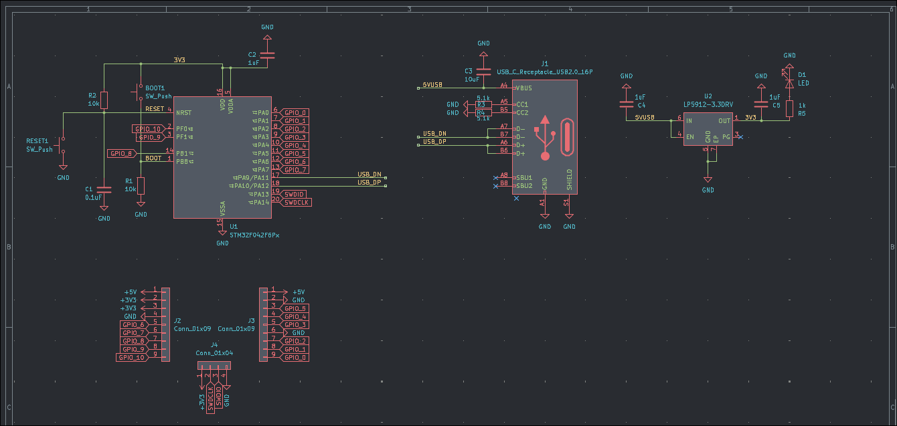
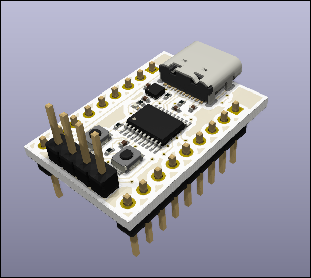
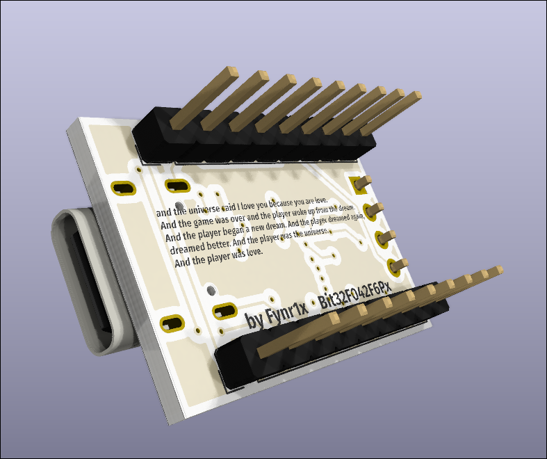

# Bit32F042F6Px

Minimal STM32F042F6Px development board. USB-C, GPIO headers, onboard 3.3V regulation. No peripherals, no bloat.

Licensed under [CERN-OHL-S v2](LICENSE).

---

## Features

- STM32F042F6Px (32KB Flash, 6KB RAM, 48MHz)
- USB-C (USB 2.0 Full Speed via PA11/PA12)
- LP5912-3.3DRV LDO — 3.3V regulated output from 5V USB
- BOOT0 and RESET buttons
- SWD header (SWDIO, SWCLK, 3.3V, GND)
- GPIO headers — all available pins broken out
- Power indicator LED

---

## Pinout

| Header | Pins |
|--------|------|
| J2 | +5V, +3V3 (x2), GND, GPIO\_6, GPIO\_7, GPIO\_8, GPIO\_9, GPIO\_10 |
| J3 | +5V, GND, GPIO\_0–GPIO\_5, GND |
| J4 | +3V3, SWDIO, SWCLK, GND |

---

## Schematic



---

## PCB




---

## Render


---

## BOM
> will be added later
---

## Programming
> will be added later
---

## Repository Structure

```
Bit32F042F6Px/
├── hardware/
│   ├── Bit32F042F6Px.kicad_sch
│   ├── Bit32F042F6Px.kicad_pcb
│   └── gerbers/
├── images/
│   ├── schematic.png
│   ├── pcb_top.png
│   ├── pcb_bottom.png
│   ├── render_top.png
│   └── render_bottom.png
├── LICENSE
└── README.md
```
